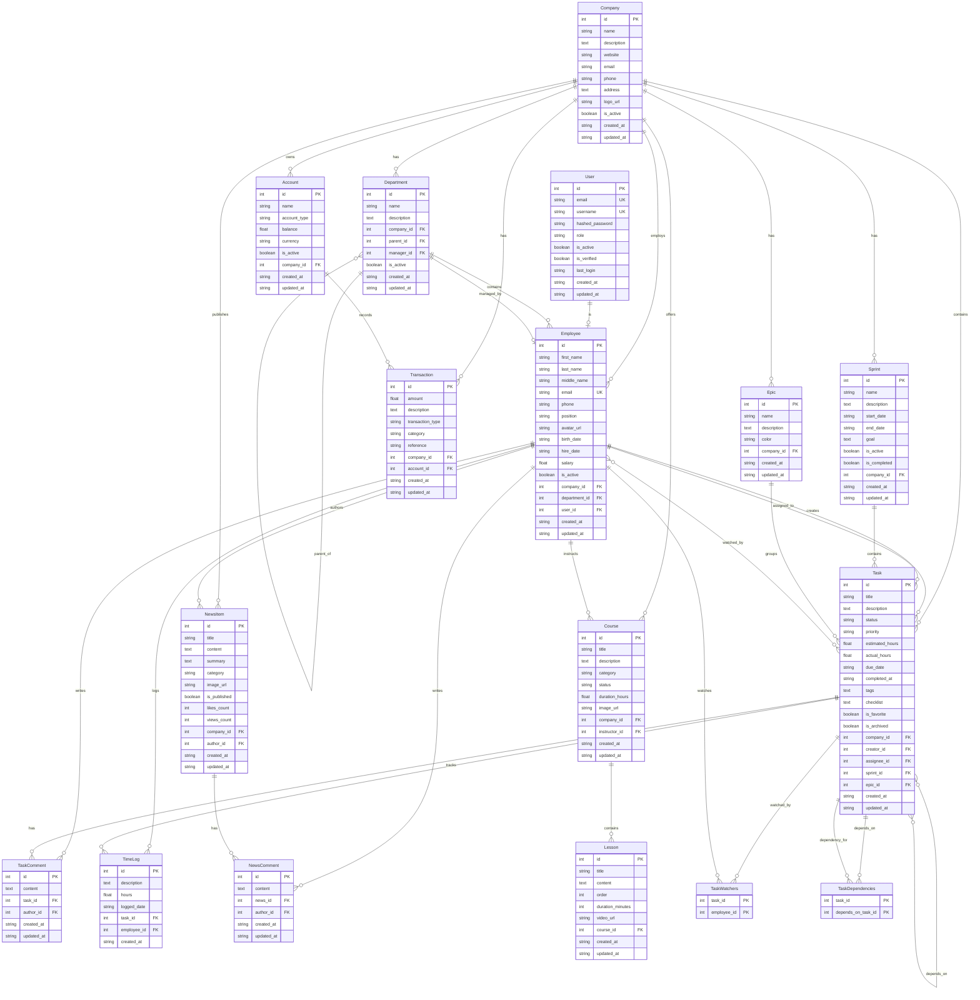

# ER Диаграмма Business Platform Database (Mermaid)

## Описание диаграммы

Эта ER диаграмма показывает полную структуру базы данных Business Platform с мультитенантной архитектурой.

### Основные сущности:
- **Company** - центральная сущность мультитенантной архитектуры
- **User** - система аутентификации (связана 1:1 с Employee)
- **Employee** - основная рабочая единица
- **Department** - иерархическая структура отделов

### Управление задачами:
- **Task** - задачи с статусами, приоритетами, зависимостями
- **Sprint** - итерации разработки
- **Epic** - крупные функциональности
- **TaskComment**, **TimeLog** - комментарии и учет времени

### Финансы:
- **Account** - финансовые счета компании
- **Transaction** - доходы, расходы, переводы

### Контент и обучение:
- **NewsItem**, **NewsComment** - корпоративные новости
- **Course**, **Lesson** - обучающие программы

### Связующие таблицы:
- **TaskWatchers** - наблюдатели задач (many-to-many)
- **TaskDependencies** - зависимости между задачами (many-to-many)